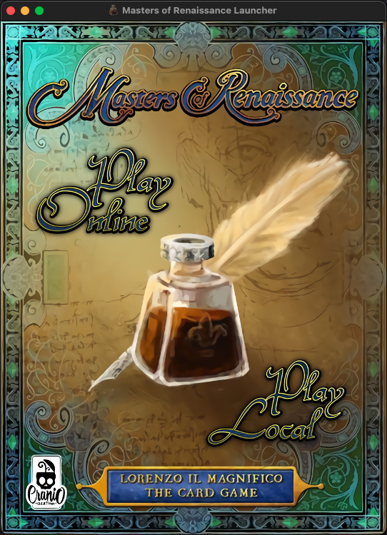
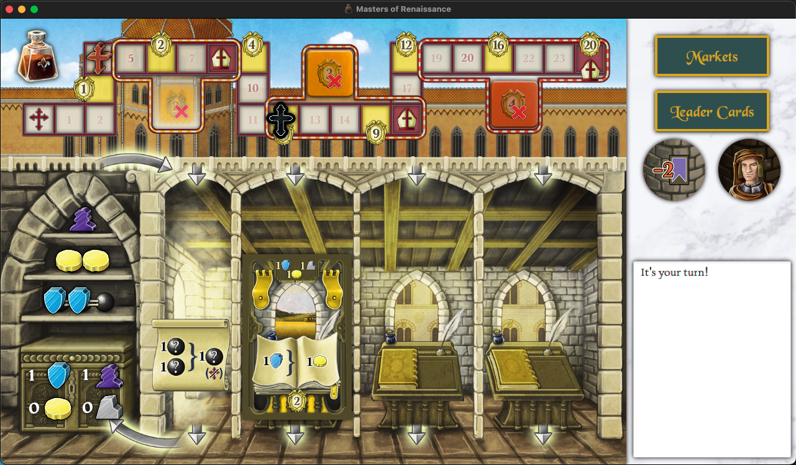
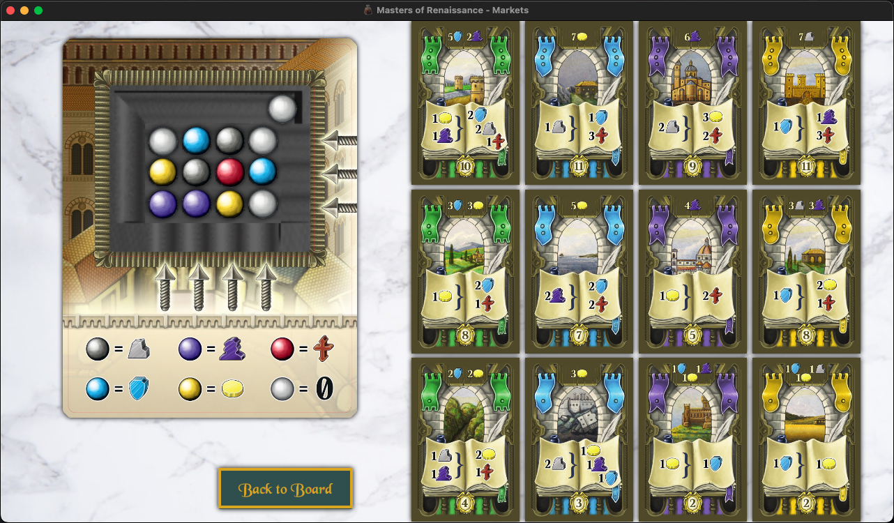

# Software Engineering Project 2020-2021

## Authors

- Giulio Occhipinti
- Chiara Falconieri

## Features

Basic             |  Advanced
:-------------------------:|:-------------------------:
Complete rules  |  Parallel games
Socket  |  Local game
CLI  |  Persistence
GUI  |

## Screenshots

Splashscreen             |  Main view
:-------------------------:|:-------------------------:
  |  

Markets view             |  Match result screen
:-------------------------:|:-------------------------:
  |  

## Requirements

OpenJDK 11 or higher: download for all platforms available at https://adoptopenjdk.net/

GNU/Linux distributions that use the apt package manager can also use `sudo apt install openjdk-11-jre`

MacOS: `brew install openjdk@11`

## Instructions - Client

deliverables/final contains launch scripts for Windows and UNIX-based systems. Alternatively, the jars can be executed with these commands:

CLI: `java -jar Client.jar -cli`

GUI: `java -jar Client.jar`

### Windows specific

In order to display UTF-8 characters used by the CLI correctly, follow these steps:
Start -> type `intl.cpl` -> press enter -> in the "Administrative" menu, click "Change System Locale", and check "Use Unicode UTF-8 for worldwide language support" in the window that pops up. Restart the system
After UTF-8 support is enabled, run start_cli.bat inside the deliverables/final folder

## Instructions - Server

On any platform, run the jar with the following command:

`java -jar Server.jar [-p port_number]`

Or use the start_server script for the respective system.

If the port number is not specified, it defaults to 2000.
